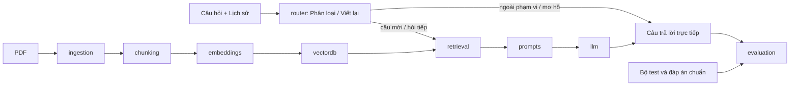

# Kiến trúc hệ thống ViGovBot

Tài liệu mô tả cấu trúc thành phần, ranh giới phụ thuộc và hợp đồng artifact của
pipeline ViGovBot. Nội dung phản ánh package `vigovbot` phiên bản 0.2.0.

## Mô hình thành phần

Mã chính nằm trong `src/vigovbot`. Package cài bằng pip và CLI `vigovbot`
không phụ thuộc thư mục làm việc của repository. Notebook cài package từ
checkout và sử dụng namespace `vigovbot.*`; lớp tương thích `src.*` đã được bỏ.

| Thành phần | Trách nhiệm |
|---|---|
| `ingestion` | Trích xuất PDF/OCR; đọc corpus dạng thư mục/ZIP |
| `chunking` | Metadata thủ tục, phân mục, chia đoạn có giới hạn kích thước |
| `embeddings` | BGE-M3, tạo pack; nạp encoder câu hỏi |
| `vectordb` | Kiểm tra/gộp pack, FAISS, cache SQLite |
| `retrieval` | Chuẩn hóa vector câu hỏi, tra FAISS và đọc metadata |
| `prompts` | Prompt tiếng Việt, ngân sách ngữ cảnh, ghi lại nguồn đã dùng |
| `llm` | Giao tiếp Ollama |
| `rag` | Chuẩn bị corpus, phiên inference, điều phối hỏi đáp/benchmark |
| `evaluation` | Bộ test, metric và báo cáo; đáp án chuẩn không đưa vào inference |
| `pipelines/indexing.py` | Điều phối PDF → chunk → báo cáo và CLI ingestion |
| `schemas.py` | Hợp đồng dữ liệu, model/kích thước vector, version artifact/cache |
| `artifacts.py` | Checksum, revision, khóa ghi và công bố artifact |
| `experiments.py` | Manifest lượt chạy và JSONL có thể tiếp tục |
| `scripts/` | Sinh notebook, xuất lock, kiểm chứng package/môi trường |

## Ranh giới phụ thuộc

`vectordb` không phụ thuộc vào pipeline tạo embedding hoặc version của `rag`.
Hợp đồng corpus dùng `schemas.py`; version cache độc lập với version pipeline đánh giá.
`utils` chỉ giữ helper nhỏ và re-export tương thích. Notebook không chứa
bản sao logic embedding/RAG; sinh lại bằng `python scripts/build_colab_notebooks.py`.

`prepare` phụ thuộc corpus; `ask` phụ thuộc corpus và mô hình. Các lệnh
`smoke`, `evaluate`, `run`, `report` phụ thuộc thêm bộ test. API Python
`answer_question()` nhận retriever/tokenizer/settings, không nhận đáp án chuẩn.

Manifest thí nghiệm lưu cấu hình, fingerprint mã xử lý, checksum bộ test/corpus,
revision embedding, digest Ollama và phiên bản runtime Python/thư viện chính.
Giữ model/tokenizer revision cố định trong cấu hình khi chốt benchmark; ghi
commit repository trong báo cáo để liên kết kết quả với lần phát hành.

## Hợp đồng artifact và tính toàn vẹn

- Corpus: `tthc_unified.index`, `tthc_unified_metadata.json`, `corpus_manifest.json`.
- Manifest: phiên bản định dạng, số dòng, SHA-256 từng file, model BGE-M3,
  commit SHA của model, kích thước 1024 và phiên bản cách ghép prefix.
- Pipeline embedding phân giải revision thành commit bất biến trước khi nạp mô hình.
- Pipeline kiểm tra metadata và vector trước khi công bố corpus hoàn chỉnh.
- RAG kiểm tra checksum trước khi FAISS đọc index, rồi kiểm tra encoder.
  `embedding.revision: null` chọn revision từ manifest; giá trị khác bị từ chối.
- FAISS dùng inner product sau chuẩn hóa L2; thứ tự metadata là ID SQLite.

Manifest được ghi cuối. Lỗi Python trong lúc công bố sẽ dọn các file vừa công bố;
mất điện/kill tiến trình có thể để lại file dở dang nhưng thiếu manifest nên bị
từ chối ở chế độ mặc định. Không ghi đè artifact đã có; chọn thư mục đầu ra mới.

Khóa file bảo vệ việc công bố artifact, tạo cache và ghi kết quả trong một
filesystem hỗ trợ khóa hệ điều hành. Khóa này không phải cơ chế khóa phân tán
giữa nhiều phiên Colab qua Drive. Mỗi lần tạo corpus và benchmark phải sử dụng
thư mục đầu ra riêng.

Checksum xác minh tính nhất quán, không xác minh tác giả. Chỉ nạp index FAISS
từ nguồn đáng tin cậy. Chế độ legacy không thể chứng minh model tạo vector.

## Phạm vi hệ thống

Hiện phục vụ nghiên cứu qua CLI, notebook Colab và web UI/API cục bộ. Web dùng
`ThreadingHTTPServer`, nạp một encoder/FAISS/SQLite dùng chung và tuần tự hóa các
lượt chat; SQLite mở read-only để truy hồi từ thread request. Lịch sử nằm trong
trình duyệt và được gửi lại theo từng model/chế độ. Chưa có lưu phiên phía server,
quản lý người dùng, xác thực/TLS hoặc pipeline fine-tuning QLoRA.
Các nội dung liên quan được quy định tại [migration](migration.md),
[môi trường](environments.md) và [quy trình phát triển](../CONTRIBUTING.md).
