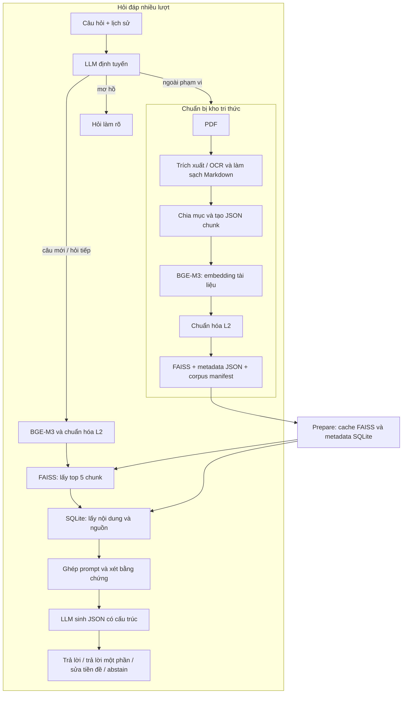

# Hướng dẫn vận hành pipeline RAG

Tài liệu quy định quy trình tạo corpus, khởi tạo hệ thống truy hồi, thực hiện truy
vấn và chạy đánh giá đối với package `vigovbot` phiên bản 0.2.0. Các lệnh được
thực thi từ thư mục gốc repository.

## 1. Tổng quan

ViGovBot là pipeline tra cứu thủ tục hành chính tiếng Việt theo mô hình **Retrieval-Augmented Generation (RAG)**: tìm các đoạn tài liệu liên quan trước, sau đó đưa chúng cùng câu hỏi vào mô hình sinh câu trả lời.

Hệ thống chạy bằng CLI Python, giao diện web cục bộ hoặc notebook Colab; hỗ trợ
hỏi đáp một lượt, hội thoại nhiều lượt và đánh giá theo bộ câu hỏi. Mã xử lý chính
nằm trong `src/vigovbot/`. Notebook cài package và dùng namespace `vigovbot.*`.

| Thành phần | Cách sử dụng hiện tại |
|---|---|
| Nguồn tri thức | PDF thủ tục hành chính, trích xuất thành Markdown; hỗ trợ OCR |
| Chia tài liệu | Chia theo cấu trúc mục, sau đó tách thành các chunk nhỏ có thông tin thủ tục |
| Mô hình embedding | `BAAI/bge-m3`, dùng `SentenceTransformer`, vector dense 1024 chiều |
| Chỉ mục tìm kiếm | FAISS `IndexFlatIP`, vector chuẩn hóa L2 |
| Nội dung và metadata khi truy vấn | SQLite, tra theo vị trí vector trong FAISS |
| Mô hình sinh | `qwen2.5:7b` chạy qua Ollama |
| Tokenizer tính ngân sách prompt | `Qwen/Qwen2.5-7B-Instruct` |
| Cách giao tiếp với LLM | HTTP `POST /api/chat`, `stream: false` |
| Điều hướng hội thoại | LLM phân loại phạm vi và quan hệ câu hỏi, đồng thời viết lại câu hỏi nối tiếp |
| Đầu ra câu trả lời | JSON có câu trả lời, hành động và trạng thái bằng chứng |

Đây là RAG truy hồi dense có lớp điều hướng nhiều lượt. Mặc định mỗi câu hỏi được
phân loại trước khi truy hồi; câu hỏi nối tiếp được viết lại thành truy vấn độc lập,
còn câu hỏi mới không kế thừa chủ đề cũ. Hệ thống không dùng BM25/hybrid search,
reranker hay agent, và không có bước huấn luyện, fine-tune hoặc QLoRA. Lịch sử do
client cung cấp cho từng lượt, chưa có kho hội thoại hoặc tài khoản người dùng ở
phía server.

## 2. Kiến trúc và luồng dữ liệu



### 2.1. Trích xuất và chia chunk

Lệnh `ingest` đọc PDF theo `configs/pipeline.yaml`, dùng cấu hình trích xuất tại `configs/ingestion.yaml` và cấu hình chia đoạn tại `configs/chunking.yaml`.

- PDF đầu vào mặc định: `Data/pdf`; giới hạn kích thước mỗi PDF: 20 MB.
- OCR được bật, ngôn ngữ `vie+eng`, DPI 300, chế độ `full: true`; cần Tesseract/tessdata tương ứng khi thực hiện OCR.
- Markdown được làm sạch rồi chia theo các mục như trình tự thực hiện, thành phần hồ sơ, cách thức/thời hạn/phí và căn cứ pháp lý.
- Cấu hình chunk: mục tiêu 1.200 ký tự, tối đa 1.500 ký tự, overlap 100 ký tự và nội dung tối thiểu 10 ký tự. Việc chia còn phụ thuộc ranh giới mục, khối văn bản và bảng; không phải mọi chunk đều có cùng độ dài.
- Chunk có prefix dạng `[Thủ tục: ... | Mã TTHC: ... | Mục: ...]`. Giới hạn tối đa tính cả prefix; prefix có thể được rút gọn để vừa ngân sách.

Mỗi chunk gồm `chunk_id`, `source_file`, `source_code`, `procedure_name`, `section_type`, `context_prefix`, `text_content` và `parent_section`. Nội dung `text_content` đã chứa prefix. Pipeline embedding chỉ bổ sung prefix nếu chưa có, tránh lặp lại.

Đầu ra bình thường là `outputs/metadata/<tên-PDF>.json`. Báo cáo xử lý nằm trong `outputs/metadata/reports/`; tài liệu cần rà soát được đưa vào `outputs/metadata/review/`. Cần đọc báo cáo và kiểm tra các trường hợp thiếu trang hoặc metadata trước khi đưa vào kho tri thức.

### 2.2. Embedding và tạo chỉ mục

Lệnh `embed` đọc toàn bộ JSON chunk từ một thư mục hoặc ZIP, tạo vector BGE-M3,
chuẩn hóa L2 và xây dựng FAISS `IndexFlatIP` trong cùng một pipeline. Corpus gồm:

```text
Data/vector/unified/
    tthc_unified.index
    tthc_unified_metadata.json
    corpus_manifest.json
```

Với vector tài liệu và câu hỏi đều có độ dài L2 bằng 1, tích vô hướng mà FAISS trả về tương đương cosine similarity. Điểm càng lớn thì vector càng gần nhau; đây không phải xác suất câu trả lời đúng. `IndexFlatIP` thực hiện tìm kiếm chính xác trên các vector trong chỉ mục.

Manifest ghi model, revision thực tế được phân giải thành commit SHA, số bản ghi và
checksum. Ba artifact chỉ được công bố sau khi toàn bộ pipeline hoàn thành.

### 2.3. Chuẩn bị cache truy vấn

Lệnh `rag prepare` xác minh corpus, sao chép index vào cache và chuyển metadata JSON sang SQLite bằng cách đọc theo luồng. Cache nằm dưới `outputs/rag_cache/<định-danh>/`, gồm index, `metadata.sqlite` và `ready.json`.

`row_id` trong SQLite chính là vị trí vector, bắt đầu từ 0. Hệ thống kiểm tra số dòng, chiều vector, loại metric và checksum để tránh dùng nhầm index với metadata. SQLite chỉ giữ các trường cần truy hồi; `parent_section` không được đưa vào cache, nên luồng hỏi đáp không tự mở rộng chunk thành toàn bộ mục cha.

### 2.4. Xử lý câu hỏi và lịch sử hội thoại

1. Nạp BGE-M3 cùng model/revision với corpus. Nếu `embedding.revision: null` và
   corpus có manifest hợp lệ, hệ thống lấy revision từ manifest.
2. Kiểm tra lịch sử `user`/`assistant`, rồi gọi LLM định tuyến để trả JSON gồm
   `scope`, `relation`, `query` và `clarification`.
3. Nếu ngoài phạm vi, trả thông báo phạm vi hỗ trợ; nếu mơ hồ, trả câu hỏi làm rõ.
   Hai nhánh này không truy hồi và không gọi lần sinh câu trả lời.
4. Câu hỏi mới dùng nguyên văn câu hiện tại. Câu hỏi nối tiếp dùng `query` độc lập
   do router tạo từ lịch sử; lịch sử và câu trả lời cũ không được đưa vào prompt
   sinh cuối để tránh mang theo khẳng định chưa được kiểm chứng.
5. Encode truy vấn thành vector 1024 chiều, chuẩn hóa L2, lấy tối đa
   `top_k = 5` kết quả từ FAISS rồi tra nội dung trong SQLite.
6. Ghép prompt trong ngân sách token. Nếu không có chunk nào thực sự vừa vào
   prompt, trả `abstain` mà không gọi sinh.
7. LLM xét bằng chứng và sinh JSON gồm `answer`, `action`, `evidence_status`.
   Pipeline kiểm tra schema và ánh xạ kết quả vào response cùng nguồn/thời gian.

Các cặp kết quả hợp lệ gồm: `answer/sufficient`, `partial/partial`,
`abstain/missing`, `correct_premise/contradictory_premise` và
`clarify/ambiguous`. Đây vẫn là tự đánh giá của cùng model sinh, không phải judge
độc lập và không bảo đảm nội dung luôn đúng. System prompt yêu cầu chỉ dựa trên
trích đoạn, không suy đoán phí/thời hạn/cơ quan/quy định và bỏ qua chỉ dẫn nằm
trong tài liệu. Chi tiết về luồng nhiều lượt và cách đánh giá nằm tại
[RAG nhiều lượt](rag-multi-turn.md).

## 3. Tham số RAG đang dùng

`configs/inference.yaml` dùng cho hỏi đáp; các tham số không khai báo lấy mặc định từ `src/vigovbot/rag/config.py`. `configs/rag.yaml` khai báo thêm dữ liệu và đầu ra đánh giá.

| Tham số | Giá trị mặc định / cấu hình hiện tại | Ý nghĩa |
|---|---|---|
| `embedding.model` | `BAAI/bge-m3` | Encoder cho câu hỏi |
| `embedding.device` | `cpu` | Dành VRAM cho Qwen; có thể đổi khi đủ tài nguyên |
| `llm.model` | `qwen2.5:7b` | Tên model trong Ollama |
| `llm.ollama_url` | `http://localhost:11434` | Địa chỉ Ollama |
| `llm.temperature` | `0.0` | Giảm tính ngẫu nhiên |
| `llm.seed` | `42` | Seed gửi cho Ollama |
| `llm.num_ctx` | `8192` | Cửa sổ ngữ cảnh yêu cầu |
| `llm.num_predict` | `512` | Số token sinh tối đa |
| `llm.timeout` | `300` giây | Timeout HTTP khi sinh câu trả lời |
| `llm.keep_alive` | `10m` | Tham số giữ model gửi trong request; pipeline yêu cầu dỡ model khi đóng phiên |
| `retrieval.top_k` | `5` | Số chunk truy hồi tối đa |
| `retrieval.max_chunk_tokens` | `1200` | Giới hạn token của mỗi chunk đưa vào prompt |
| `conversation.routing_enabled` | `true` | Bật định tuyến nhiều lượt và xét bằng chứng có cấu trúc |
| `data.allow_legacy_corpus` | `false` | Mặc định yêu cầu corpus có provenance/manifest |

Ngân sách prompt trả lời là `8192 - 512 - 256 = 7424` token, trong đó 256 token
được dự phòng cho template. Ngân sách này bao gồm system prompt, câu hỏi và trích
đoạn. Router cũng kiểm tra prompt riêng theo cùng giới hạn; lịch sử quá dài gây lỗi
thay vì bị cắt âm thầm. Chunk có thể bị cắt ngắn hoặc không được đưa vào khi hết
chỗ. `max_chunk_tokens` tính bằng **token**, khác với tham số chunking tính bằng
**ký tự**.

## 4. Triển khai trên máy cục bộ

### 4.1. Chuẩn bị môi trường

Repository khai báo Python 3.10–3.14. Ví dụ sau dùng PowerShell và gọi trực tiếp Python trong venv, không cần kích hoạt môi trường:

```powershell
python -m venv .venv
.venv\Scripts\python -m pip install -e ".[pdf,embedding,vector,rag,evaluation]"
.venv\Scripts\python -m vigovbot --help
```

Linux/macOS thay `.venv\Scripts\python` bằng `.venv/bin/python`. Cách dùng dependency lock theo nền tảng được mô tả trong [Môi trường và tái lập](environments.md).

Cài Ollama và tải model bằng lệnh:

```powershell
ollama pull qwen2.5:7b
ollama list
```

Ollama cần phục vụ tại địa chỉ cấu hình. Nếu dịch vụ chưa chạy, mở terminal riêng và chạy `ollama serve`. Lần đầu chạy pipeline cần mạng để tải BGE-M3, tokenizer Qwen và, nếu tạo báo cáo đánh giá, model BERTScore. OCR cần cài riêng Tesseract cùng dữ liệu ngôn ngữ Việt/Anh.

### 4.2. Tạo corpus từ PDF

Đặt PDF vào `Data/pdf`, rồi chạy:

```powershell
.venv\Scripts\python -m vigovbot ingest --config configs/pipeline.yaml
```

Có thể xử lý nhiều PDF song song bằng `--workers`. Ví dụ với máy 18 luồng CPU và
28 GB RAM, có thể bắt đầu với 6 worker khi OCR được bật:

```powershell
.venv\Scripts\python -m vigovbot ingest --config configs/pipeline.yaml --workers 6
```

Giá trị mặc định là 1. File đã hoàn tất vẫn được giữ lại và được bỏ qua khi chạy
lại nếu không dùng `--overwrite`.

Kiểm tra JSON và báo cáo trong `outputs/metadata`. Pipeline embedding có thể nhận
trực tiếp thư mục này hoặc một ZIP chỉ chứa các JSON chunk đã rà soát. Không đưa
`reports/` và `review/` vào nguồn embedding.

```powershell
.venv\Scripts\python -m vigovbot embed outputs/metadata --output-dir Data/vector/unified-new
```

Ví dụ sử dụng `unified-new` vì pipeline từ chối ghi đè corpus đã tồn tại. Với dữ
liệu lớn, điều chỉnh `--batch-size`, `--device` và tài nguyên máy. Pipeline nhận
một nguồn dữ liệu và công bố trực tiếp corpus hoàn chỉnh.

Đổi `data.unified_source` trong cấu hình cần chạy thành `../Data/vector/unified-new`. Các đường dẫn trong YAML được tính từ **thư mục chứa YAML**, còn đường dẫn truyền trực tiếp qua CLI được tính theo thư mục làm việc.

### 4.3. Dùng corpus có sẵn trong workspace

Tại thời điểm kiểm tra, `Data/vector/unified/` có `tthc_unified.index` và `tthc_unified_metadata.json`, nhưng chưa có `corpus_manifest.json`. Vì vậy, cấu hình mặc định `allow_legacy_corpus: false` sẽ không chấp nhận bộ dữ liệu này.

Có thể tạo lại corpus theo bước 4.2 để có manifest và revision xác minh được. Nếu cần chạy bộ hiện có, tạo file riêng `configs/inference-local.yaml`:

```yaml
data:
  unified_source: ../Data/vector/unified
  cache_dir: ../outputs/rag_cache_legacy
  allow_legacy_corpus: true
embedding:
  model: BAAI/bge-m3
  revision: null
  device: cpu
llm:
  model: qwen2.5:7b
  ollama_url: http://localhost:11434
```

Chế độ legacy vẫn kiểm tra cấu trúc index và metadata nhưng không xác minh được model/revision đã tạo vector tài liệu. Khi thiếu manifest, `revision: null` không thể tự khôi phục revision gốc. Chi tiết tại [Migration dữ liệu cũ](migration.md).

### 4.4. Chuẩn bị và hỏi đáp

Với corpus mới đã cập nhật trong `configs/inference.yaml`:

```powershell
.venv\Scripts\python -m vigovbot rag --config configs/inference.yaml prepare
.venv\Scripts\python -m vigovbot rag --config configs/inference.yaml ask --question "Cần những giấy tờ gì để cấp bản sao hộ tịch?"
```

Nếu dùng corpus cũ theo bước 4.3, thay đường dẫn cấu hình trong cả hai lệnh bằng `configs/inference-local.yaml`. `prepare` chỉ chuẩn bị corpus/cache, chưa tải encoder hoặc gọi LLM; `ask` cũng tự chuẩn bị/kiểm tra cache trước khi truy vấn. Hỏi đáp không cần bộ câu hỏi đánh giá.

Để hỏi nối tiếp, lưu các lượt trước vào một mảng JSON gồm message `user` và
`assistant`, rồi truyền file bằng `--history`:

```powershell
.venv\Scripts\python -m vigovbot rag --config configs/inference.yaml ask `
  --question "Còn lệ phí thì sao?" --history history.json
```

CLI không tự lưu lịch sử giữa hai lần chạy; ứng dụng gọi phải giữ và gửi lại đúng
lịch sử. Khi `conversation.routing_enabled: false`, pipeline chạy chế độ đối chứng
cũ: chỉ viết lại khi có history, không phân loại phạm vi và không bắt buộc đầu ra
xét bằng chứng có cấu trúc.

Kết quả `ask` được in dưới dạng JSON:

| Trường | Nội dung |
|---|---|
| `prediction` | Câu trả lời của Qwen |
| `action`, `evidence_status` | Hành động và mức bằng chứng do model trả về |
| `routing`, `retrieval_query` | Quyết định định tuyến và truy vấn độc lập thực tế |
| `retrieved` | Các chunk đã tìm được, kèm ID, điểm, file và mã thủ tục |
| `context_used` | Nguồn và phần văn bản thực sự đưa vào prompt sau khi cắt token |
| `prompt_tokens_estimated` | Số token prompt ước tính bằng tokenizer Qwen |
| `routing_s`, `retrieval_s`, `generation_s`, `latency_s` | Thời gian từng bước và toàn lượt; không gồm toàn bộ thời gian khởi tạo CLI/model |
| `raw_routing`, `raw_ollama` | Phản hồi gốc của lần định tuyến và sinh |

`retrieved` có thể nhiều nội dung hơn `context_used`; khi kiểm tra căn cứ câu trả lời, cần xem phần thực sự được đưa vào prompt.

### 4.5. Chạy giao diện web

Sau khi corpus đã sẵn sàng, khởi động server HTTP cục bộ:

```powershell
.venv\Scripts\python -m vigovbot rag --config configs/inference.yaml web `
  --host 127.0.0.1 --port 8000
```

Mở `http://127.0.0.1:8000`. Server nạp encoder, tokenizer, FAISS và SQLite một
lần, cung cấp `GET /api/health`, `GET /api/models` và `POST /api/chat`. UI giữ
lịch sử riêng cho từng model trong trình duyệt và gửi lại qua mỗi request; server
không lưu phiên hội thoại. Các request chat được khóa và xử lý model đã chọn theo
thứ tự để dùng chung tài nguyên an toàn.

`configs/inference.yaml` khai báo sẵn hai lựa chọn cùng dùng `qwen2.5:7b`:

- `mode: base`: gửi câu hỏi và lịch sử thẳng tới Qwen, không gọi embedding,
  FAISS/SQLite hoặc prompt RAG; kết quả không có nguồn.
- `mode: rag`: chạy toàn bộ router, truy hồi và xét bằng chứng; kết quả có các
  nguồn được truy hồi.

Chọn cả hai trên UI để xem hai câu trả lời cạnh nhau. Đây là so sánh chế độ suy
luận trên cùng model instruction `qwen2.5:7b`; chữ "base" không chỉ một base
checkpoint riêng chưa instruction-tune.

Nếu `web.models` trống, server dùng model Ollama trong nhóm `llm` với ID
`default` và `mode: rag`. Có thể khai báo tối đa tám lựa chọn trong một request,
với provider `ollama` hoặc `openai_compatible`. Provider bên ngoài chỉ đọc khóa
từ biến môi trường có tên trong `api_key_env`; không ghi khóa trực tiếp vào YAML.
Đây là server nghiên cứu không có xác thực, TLS, lưu phiên hay kiểm soát truy cập;
giữ mặc định loopback và chỉ bind `0.0.0.0` trong mạng tin cậy.

## 5. Chạy đánh giá

Chuẩn bị `Data/qa_test/dataset.jsonl` hoặc cấu hình `dataset_zip`. Kiểm tra `unified_source`, chế độ legacy nếu cần và chọn `output_dir` phù hợp trong `configs/rag.yaml`.

```powershell
.venv\Scripts\python -m vigovbot rag --config configs/rag.yaml smoke
.venv\Scripts\python -m vigovbot rag --config configs/rag.yaml run
```

`smoke` thử tối đa 5 câu theo cấu hình hiện tại. `run` thực hiện chuẩn bị, smoke test, đánh giá rồi tạo báo cáo. Có thể dùng riêng `evaluate` để sinh kết quả và `report` để tính metric/tạo báo cáo. `max_cases: null` nghĩa là dùng toàn bộ bộ dữ liệu đã nạp; có thể đặt số nhỏ khi thử nghiệm.

Đầu ra mặc định ở `outputs/qwen2_5_7b_rag_results`, có manifest lần chạy, kết quả dự đoán, lỗi nếu có, `case_metrics.jsonl`, `case_metrics.csv`, `summary.json` và báo cáo theo nhóm. Metric gồm exact match, accuracy chuẩn hóa, BLEU-4, ROUGE, BERTScore, source recall@k và thời gian xử lý. BERTScore mặc định dùng `xlm-roberta-large` trên CPU, batch size 1.

Manifest gắn kết quả với code, cấu hình, dữ liệu, corpus, môi trường và digest model Ollama. Chọn thư mục đầu ra mới khi thay đổi thí nghiệm để không trộn kết quả không tương thích.

## 6. Colab và giới hạn hiện tại

Notebook tạo corpus: `ipynb/build_corpus.ipynb`; notebook RAG:
`ipynb/base_rag/lqwen2_5_7B_rag.ipynb`. Notebook cài package từ checkout và tạo
cấu hình riêng. Cần chọn `GIT_REF` đã có trên GitHub và chuyển đủ ba artifact
corpus giữa các môi trường.

Các điểm cần tính đến khi sử dụng:

- Truy hồi hiện lấy top-k mà chưa có ngưỡng điểm tối thiểu hoặc reranker. Router
  chặn câu ngoài phạm vi và bước sinh tự xét bằng chứng, nhưng cả hai vẫn phụ thuộc
  hành vi LLM; chunk ít liên quan có thể dẫn đến quyết định sai.
- Lỗi OCR, thiếu trang, chunk bị cắt hoặc dữ liệu thủ tục chưa cập nhật đều có thể làm câu trả lời thiếu/sai. Pipeline không tự kiểm chứng hiệu lực của nội dung nguồn.
- SQLite giúp đọc metadata theo nhu cầu, nhưng FAISS vẫn nạp chỉ mục vào RAM; bước tạo corpus giữ metadata và ma trận vector trong RAM. Cần tính tài nguyên theo corpus và model thực tế, chưa có cấu hình RAM/VRAM tối thiểu được đảm bảo trong mã nguồn.
- Có web server/UI cục bộ cơ bản nhưng chưa có xác thực, TLS, persistence hội
  thoại, quản lý người dùng hoặc triển khai production. Lịch sử nằm ở client;
  nhiều worker/process sẽ không tự chia sẻ phiên hay tài nguyên đã nạp.

## 7. Đối chiếu với mã nguồn

| Nội dung | File chính |
|---|---|
| Entry point CLI | [cli.py](../src/vigovbot/cli.py) |
| Trích xuất và xuất JSON | [indexing.py](../src/vigovbot/pipelines/indexing.py) |
| Chunking theo cấu trúc | [markdown.py](../src/vigovbot/chunking/markdown.py) |
| Tạo embedding và corpus FAISS | [corpus_builder.py](../src/vigovbot/embeddings/corpus_builder.py) |
| Cache SQLite | [vector_store.py](../src/vigovbot/vectordb/vector_store.py) |
| Truy hồi | [retriever.py](../src/vigovbot/retrieval/retriever.py) |
| Prompt và ngân sách token | [prompt_templates.py](../src/vigovbot/prompts/prompt_templates.py) |
| Gọi Ollama | [llm_client.py](../src/vigovbot/llm/llm_client.py) |
| Định tuyến hội thoại và kiểm tra JSON | [routing.py](../src/vigovbot/rag/routing.py) |
| Điều phối RAG | [pipeline.py](../src/vigovbot/rag/pipeline.py) |
| Giá trị cấu hình mặc định | [config.py](../src/vigovbot/rag/config.py) |
| Web server và API cục bộ | [app.py](../src/vigovbot/server/app.py) |
| Adapter Ollama/OpenAI-compatible | [providers.py](../src/vigovbot/server/providers.py) |
